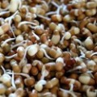

# Software Engineer's Dish

<h1 align="center">

</h1>

 

# Screenshots / Photo

 

# Requirements / Ingredients

|            Ingredients                                  | Info     |
| -------------------------------------------- | ------------------------------------------------------------------------------------------------------------------------------------ |
| 1. Moth beans                                |      |
| 2. Green grams (Mung beans)                  |  |
| 3. Groundnuts (Peanuts)                      |                                                                                                             |
| 4. Corn                                      |                                                                                                                                      |
| 5. Onion, Tomato, Cucumber, Carrot, Beetroot |                                                                                                                                      |
| 6. Salt, Chilli powder, Garam/Chat masala    |                                                                                                                                      |
| 7. Lemon and Coriander leaves for topping    |                                                                                                                                      |

 

# Development / Preparation

**1. Sprout:** Sprout the moth beans, green grams and groundnuts

**2. Chop:** Chop onion and tomato

**3. Grate:** Grate carrots, cucumber and beetroot

**4. Sprinkle:** Sprinkle salt, chilli powder and garam/chat masala. Also squeeze the lemon

**5. Mix!** Add corn and coriander leaves and mix/stir them all!

 

# Bugs

I didn't get any bugs in my preparation. If you find any, make sure you don't eat them!

 

# License

 
