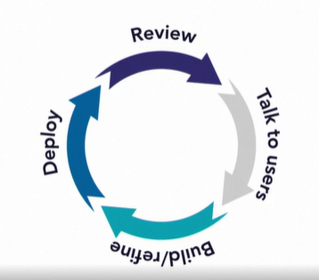

# Software Architecture Foundations

*Notes from various sources including the [LinkedIn Learning course](https://www.linkedin.com/learning/software-architecture-foundations) by Allen Holub*

 

* Software architect designs the structure of a complete system.
* A good architect starts with the customer needs and works down towards the implementation.

 

## The Architect

### The Agile Architect vs The Traditional Architect

The traditional (waterfall model) architect thinks he's the sole designer of the system, above everyone who implements the project.

### 👎 Drawbacks of the traditional architect:

1. Doesn't capture the users' true needs
2. Big and complex designs
   1. code is written after the design
   2. doesn't allow for learning
3. Lack of flexibility
   1. painful bureaucratic processes
   2. not following the design
4. Slow development process
   1. centralized architect-making decisions
   2. wasted time & money

* UMLs are a joke.

* The too-detailed diagram becomes redundant when it's as complicated as the code and also makes it hard to adapt to new changes.
* In Agile, you:
 

* This would be ideally a 2-day max cycle.

 

| Agile | Traditional |
| ---- | --- |
| Everybody is an architect | Single architect |
| Nobody asks permission to experiment | Architect controls permissions |
| Nudges/suggests towards better decisions | Orders |

 

* Agile architect's job is to *teach, coach and coordinate*. He's a servant leader. His main design responsibility is to assure coherence across the system.

* A good architect is also a good developer.
* Good architecture:
  * Simplicity
  * Maintainability
  * Testability

 

## Thinking Architecturally

### Conway's Law

*Any organization that designs a system... will inevitably produce a design whose structure is a copy of the organization's communication structure.*

&nbsp;&nbsp;&nbsp;&nbsp;&nbsp;- Mel Conway

 

* With siloed teams, you end up with something called N-Tier system, where the database, business logic and the user-interface are all different and inefficiently organized.
* In agile world, you work on thin vertical slices of work throughout the entire system (as opposed to horizontal slices of work for each department).
* All departments work on small goals all at once (as opposed to each team trying to work on different goals).
* A narrow piece of work that results in something useful for the end-user is called a story. All teams work on this story.

 

| Big Upfront Design (BUFD or Waterfall) | Agile |
| --- | --- |
| Design the whole plan and then start implementing | Plan a bit, implement and reiterate, things may change, that's how nature works |
| Siloed teams, slowed processes | Quick interacting teams, active and agile processes, that's what nature likes |
| They try to come up with universal design for modules, no room for context | Context matters, nature isn't perfect |
| Here you start by designing the database, and then
business logic and then UI | Start with the work that your customers have to do (e.g., use case) |
| Need to decide early what technology to use | Defer technology based on the above |
| Focus is on the implementation technology | Focus is on the customer needs |
| Parts that customer sees becomes an afterthought | Technology is deferred into last responsible moment |

 

* **Domain Driven Development (DDD)**: An agile methodology, states that the structure of your code should map the structure of the problem domain.
* DDD solves Conway's law problem. E.g., if you're writing an accounting system, your modules/classes should represent accountants, ledgers, balance sheets, etc.
* Bounded context: The idea of bounded context is that there are natural divisions within the business whose problems we're solving.
* *Remember that the models reflect the business, not the implementation technology*
* Ubiquitous language in DDD: Speak the same language of your customers. The same word can mean different things under different contexts. This is okay.

<h3 align="center"><i> context matters </i></h3>

* E.g., Both customer and store employee may have 'order_item' but the type of orders may be different.
* In Big Upfront world, architects try to come up with universal notion of modules.
* Then design becomes hard, for e.g., two separate modules for 'order_item' or biiig names like 'order_item_customer' and 'order_item_employee'.

 

* **Agents**: In programs, modules communicate through portals. In microservices architecture, the context becomes small standalone programs that run independently. These course grained implementation units can be called objects. But a better word is agents.
* Agents functionalities gotta be abstracted.
* Agent technologies:
  1. Messaging: simplify communication across a network
  2. Caching
  3. Logging
  4. Monitoring: resource utilization

* Good architecture means exploring open-source and not fully embracing read-made options from big companies which lock you in and may not provide full control/flexibility.

 

## Design Process

Steps in general:
1. Problem statement
   1. problem
   2. solution
2. User story
   1. Describe an *end user* (not yours) going through a domain-level process to achieve some *valuable* outcome.
   2. ~~Doesn't describe a computer program.~~
   3. A well written story should fit on a single sticky note. Sticky notes can be better than using some complicated software.
3. Identifying agents.

 

### User-story

* Horizontal slicing:
  * Database *and then* business logic *and then* UI.
  * Here, in the first slice, nothing useable is delivered.
* Vertical slicing:
  * A bit of database, a bit of business logic or UI - anything that's quickly doable and useable in ~2 days.
  * In a flowchart/activity diagram, every complete single path that starts from beginning and ends in something valuable achieved is a potential narrowed-story.
* Every path would be a smaller story than the entire diagram. This is called workflow isolation - narrowing the scope of a story by removing alternative workflows.
  
 

### Agents

* Class/sub-systems/microservices
* **Event storming:**
  * (Different colored sticky notes arranged in a timeline order. Most of below steps are suggestive)
  * 🟧 Decide on domain level events. E.g., video uploaded, video added to playlist.
  * 🟦 Decide on work that happens when the event is received.
  * 🟨 Decide on the bounded context in the agents (DDD calls these as entities).
  * Create another set of sticky notes that show all the agents and who they talk to. Pin them and use threads to show connections. This is like an OOP's class diagram.

 

## Architecture types

| System architecture | Enterprise architecture |
| --- | --- |
| Structure of a specific computer system | Describes structure of business itself |
| Shows how modules work | Shows how things get done and how people communicate |

* Enterprise architecture (EA) is a failed approach, many believe.
* Because it treats the entire system as a single organism that it models in all of its complexity, which is entirely unnecessary. It can be eliminated by looking it as a large system as a set of *cooperating smaller systems*. Agile principles also don't recommend designing large architecture with not much use. 
* An enterprise-level agile system is comprised of small, cooperating but standalone parts, whereas EA is one large system. 

 

## Design patterns

The modern design pattern came out of Christopher Alexander's work on building architecture. "When you focus on a single aspect of several successful buildings over different time periods, certain patterns are discovered (not invented)".

* *A pattern is defined by its purpose, not its structure.*

 

### Monoliths

* In a monolithic architecture, the entire program is one large executable unit. Ancillaries like databases support this monolith. 
* Agility is impossible for monoliths.
* Basically a bad architecture except for rare cases.

 

### Microkernel (plugin) architecture

* First example: OS.
* Kernel does the essential work and any additional programs plug-in to the kernel and perform tasks.
* Microsoft Azure and AWS use this structure.
* Pros:
  * Isolation helps
  * Plugins are small and easy to create/maintain.
* Cons:
  * Any change in APIs (of OS, e.g.), all the plugins (apps) need to be rewritten.
  * Kernel is a SPOF (Single Point Of Failure).
  * Plugins are indirectly communicating through the kernel.
* Apple OS structure probably has one of the strongest kernels.

 

### Message-based architecture

* Solves the SPOF communication problem in microkernels.
* Tries to make a single system out of smaller systems that aren't designed to work together.
* First example: Real-Time OS (RTOS).
* Systems *messaging each other to work for a bigger goal* is a big f deal 💡.
* The smaller systems share messages over a shared messaging infrastructure.
* The agents can talk to one another directly through a **broker**. That way they don't have to know each others address - knowing the broker is enough. A good security design 🔒, eh?

 

* Another main model that messaging systems use: **Publish/Subscribe (Pub/Sub) model**. Here, instead of waiting in a queue for a message, agents interested in receiving a message subscribe to that message (not the messager! 🔒) through the broker.
* Messages can be made even more fine-grained with message topics.

 

* Pros:
  * And just like that, messaging architecture allows the components to be isolated in extreme ways. Each component can be maintained independently. Solves SPOF problem as well.
* Cons:
  * System complexity is high - managing becomes tough.
  * Can be slow.

 

### Microservices

* A large system is made out of very small (micro) systems cooperating with each other as peers to get the larger work done.
* Services can be spread across a network, even internet and redundancy is built in.
* Many instances of the same service can run in parallel.
* Very resilient and good at stress handling.
* Requirements:
  * Smoll.
  * Independently deployable.
  * Fully autonomous - service are self-dependent.
  * Services hide implementation details.
  * Distributed - need to work in an unreliable-network environment.
  * Highly observable - log pro max.
  * Modeled around business concepts.
* This kind of system can be updated very quickly.
* Cons:
  * Design and runtime complexity.

 

### Reactive and choreographed systems

* Patterns intermingle. Microservices are often built as Reactive systems.
* (Synchronous or non-sync.) declarative approach has some downsides. It's like giving orders. The one taking the order can do whatever it wants to deliver the work. What if it gets depressed and all that. The declarer wouldn't know.
* But Reactive systems solve this problem.
*  Decoupling helps.
*  Adding any number of additional downstream clients is easy.
*  Faster than declarative

 

 
